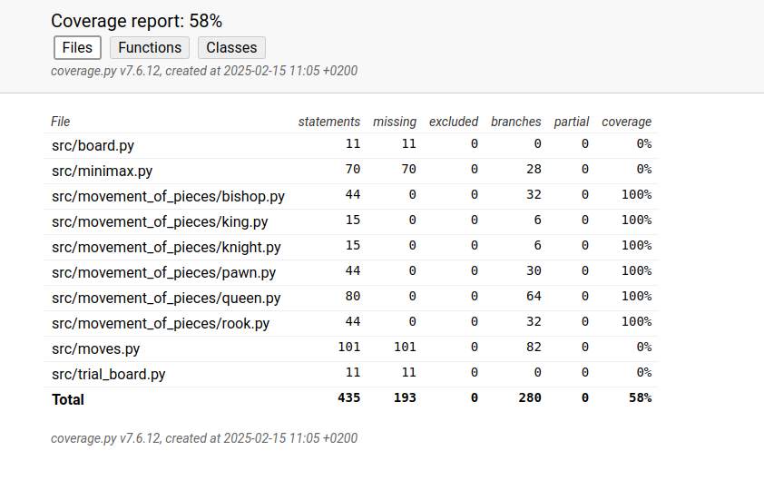

# Testausdokumentti

## Kattavuusraportti

## Mitä on testattu

Tällä hetkellä on testattu pelinappuloiden liikkeiden oikeellisuus yksikkötesteillä. Yksikkötestit testaavat kansion *src/movement_of_pieces* tiedostoja.

## Testien syötteet

Pelinappuloiden liikkeiden oikeellisuuden testaukseen käytettiin syötteenä listamuodossa olevan pelilaudan tilannetta.

## Testien toisto

Testit voidaan toistaa komentoriviltä syötteellä "poetry run pytest".

## Coverage report

