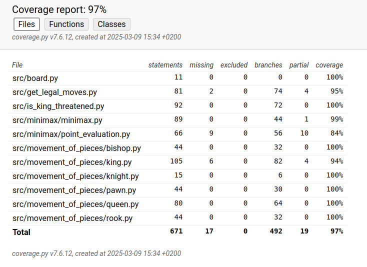

# Testausdokumentti

## Kattavuusraportti

## Mitä on testattu

Tällä hetkellä on testattu pelinappuloiden liikkeiden oikeellisuus yksikkötesteillä unittest-kirjaston avulla. Yksikkötestit testaavat kansion *src/movement_of_pieces* tiedostoja, sekä tiedostoja is_king

## Testien syötteet

Pelinappuloiden liikkeiden oikeellisuuden testaukseen käytettiin syötteenä listamuodossa olevan pelilaudan tilannetta.

## Testien toisto

Yksikkötestit voidaan toistaa komentoriviltä syötteellä 

```bash
poetry run pytest".
```
Robotframework testit voidaan toistaa komentiriviltä komennolla

```bash
poetry run robot src/tests
```

## Coverage report



## Viitteet
https://chesspuzzlesonline.com/chess-tactics/chess-puzzles-mate-in-4/